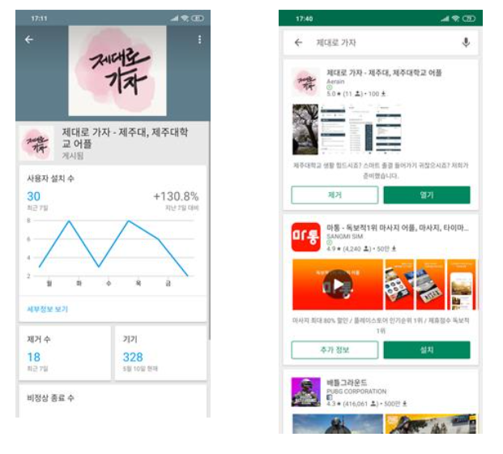

# HyeonGyu-OH

## "새로운 것을 두려워 하지 않음"
  저는 모르는 것, 안되는 것이 있으면 밤을 새서라도 될 때까지 해결하려는 끈기와 도전정신을 가지고 있습니다. 
평소 학과생활을 하면서 많은 팀 프로젝트를 수행했습니다.팀원들과 의견 조율을 통해서 나온 주제에 맞게 제가 모르는 분야의 기술을 공부해야 하는 경우도 생기게 됩니다.
4학년 캡스톤 과목 팀 프로젝트에서 갑작스럽게 안드로이드 앱 백엔드 작업을 맡게 됐었습니다. 주로 프론트엔드 작업을 했던 저로써는 당시 안드로이드이 미지의 영역처럼 느껴졌지만,  등 안드로이드 코어에 대한 이해도 할 수 있는 능력을 갖추었습니다.
  몇 날 며칠밤을 새워가며 기능을 구현하면서 '서버와 통신은 Main Thread 가 아닌 비동기통신으로 해야한다' 등 안드로이드 코어에 대한 이해까지도 할 수 있게 되었습니다. 따라서 하나하나 내용을 이해하며 프로젝트를 진행한 결과,캡스톤 발표 이후 교수님께 기술적으로 잘 구현해냈다는 칭찬을 받았습니다. 
저의 이러한 끈기와 도전정신은 새로운 업무가 주어져도 포기하지 않고 책임감있게 대응할 수 있는 업무능력으로 이어질 수 있다고 생각합니다. 

## "사람들과 잘 어울리고, 배려할 줄 아는 사람"
  저는 새로운 사람들을 만나 소통하고 그 자리를 주도적으로 이끄는 것을 좋아합니다. 저의 이러한 성향에 따라 총학생회 선거운동본부 국장을 맡아 30명에 달하는 국원들도 이끌어 나갔고, 더불어 여러 분야의 아르바이트 경험을 하며 다양한 세대의 사람들과 소통할 수 있는 기회를 접했습니다. 
그 중에서도 저는 '손님은 왕이 아니다. 손님은 친구다.'라는 슬로건으로 손님과의 소통을 중요시하는 '청년 사장들'이라는 회사의 프리랜서로 활동하며 한 맥주집의 요리 및 서빙을 하며 저의 소통능력과 People Sense를 발휘 하였습니다. 그로인해 아직까지도 사람들과 인간관계를 잘 형성하고 있습니다.
. 

## So What?
   제가 생각하는 기획부서란, 사용자에게 조금 더 편리함을 줄 수 있는 방법이 무엇인지를 생각하며 프로젝트를 기획하는 부서라고 생각합니다. 따라서 새로운 것을 좋아하고 새로운 환경에 적응이 빠른 저의 성격이 기획부서의 성향과 잘 맞는다고 생각합니다. 
어떤 주제로 기획이 되어도 잘 적응하고, 만들어진 작품을 자식처럼 생각함으로써  더 발전 할 수 있는 방향을 기획 해 나갈 것 입니다!

## 뭐했냐?
1. 제대로 가자 (https://github.com/aerain/jedaeroReactNative)  
  기존에 만들었던 제주대학교에 다양한 정보를 제공하는 웹앱인 '제대로 가자'의 서버 상시 오픈의 문제점과 프론트엔드와 백엔드의 알고리즘의 문제점을 고치고, 앱을 통해서 언제든지 필요한 정보를 얻게 하기 위해서 리뉴얼을 기획했습니다. 사용언어는 하나의 코드로 ios ,android 앱을 동시 개발할 수 있는 React-Native를 사용했습니다.
앱스토어에는 년 간 개발자 등록비 13만원을 지불할 자금이 없어서 출시를 못하는 상황인데 현 총학생회장과 면담을 통해서 지원금을 얻어서 출시를 할 예정입니다! 
<pre>
 - 교내 순환버스 출발시간
 - 도서관 내 도서검색
 - 학식 및 기숙사식당 주간 요일별 메뉴
 - 캠퍼스 내 식당들과 배달 가능 식당 전화번호 리다이렉션
 - 제주대 공식 학사일정
 - 스마트출석 페이지 리다이렉션
</pre>

  

2. GIFT ( https://github.com/g-i-f-t/GiftApplication )
  GIFT( Game Industy Funding Trade )는 인디게임을 출시하고 싶지만 초기자본을 구하기 어려운 개발자들을 크라우드 펀딩을 통해 자금을 서비스입니다. 
프로젝트 초반 DB제작을 완성하고 앱 백엔드작업에 투입했습니다. 

3. 캐글 타이타닉 컴피티션 밋업

4. 아두이노 가습기 원격 제어 시스템( https://github.com/rbrbrb7290/Arduino )
고압전류가 흘러서 위험할 수도 있는 멀티탭 전원 개조 시도!

